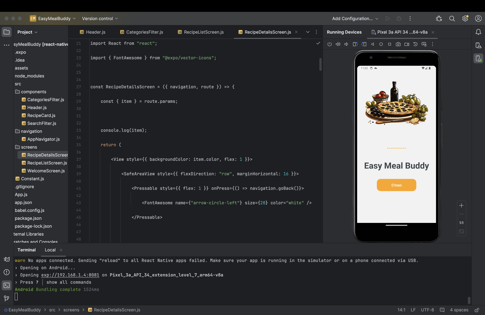
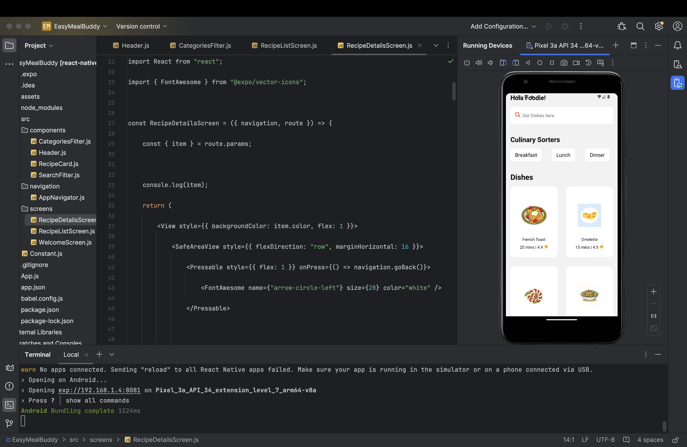
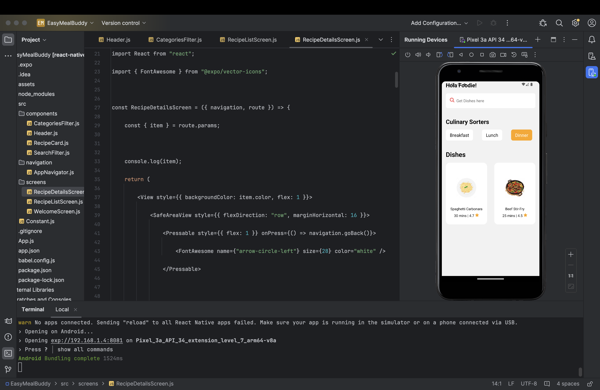
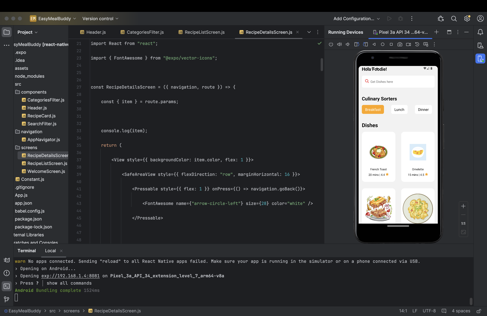
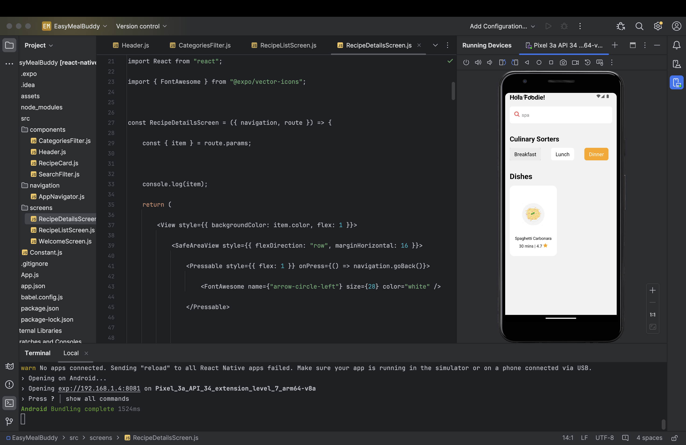
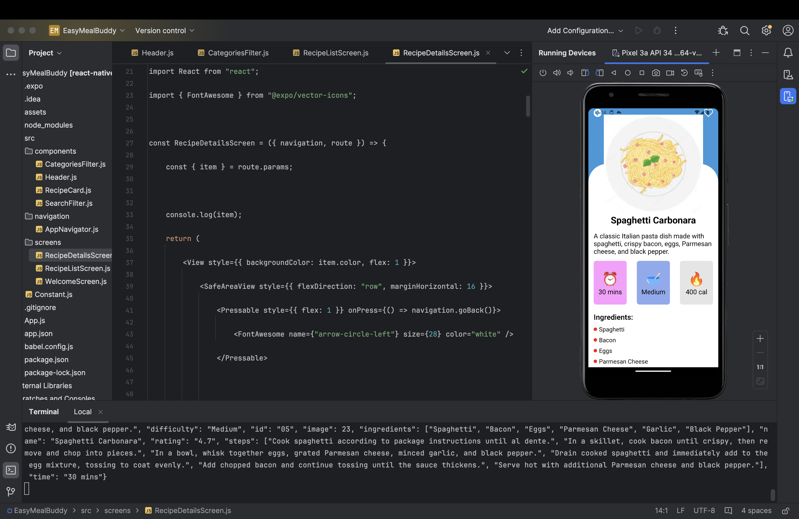

# Tech for Mobile Application
# Easy Meal Buddy - A React Native App

## Team-28

**Team member-1**: Sai Abhishek Avusula

**Team member-2**: Mallika Tekula

**Team member-3**: Bharathi Erla

## Overview 

EasyMeal Buddy is a user-friendly app revolutionizing meal planning with personalized recipe suggestions, diverse cuisines, and efficient shopping lists. It aims to save time, promote healthy eating, foster community engagement, and continuously evolve based on user feedback.

## Project Description:

####  Video Demonstartion link:
[video_demonstration/video.mp4](video_demonstration/video.mp4) 

####  a. HTML (5 pts) 

 

 

 

 

 

 

 

 

